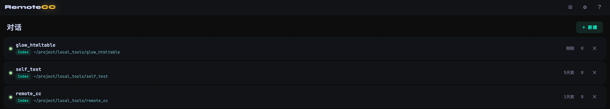
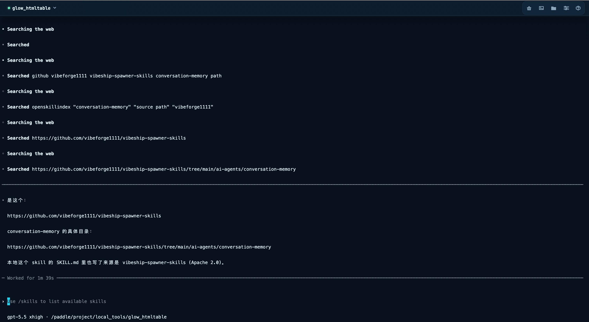
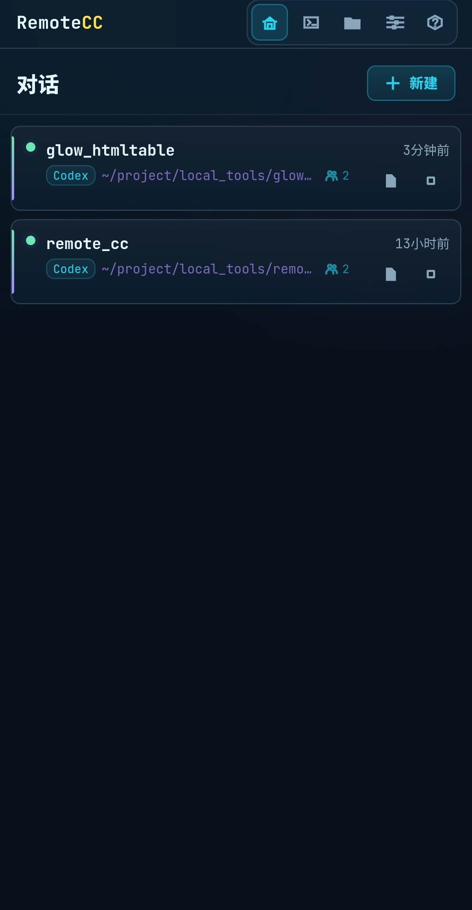
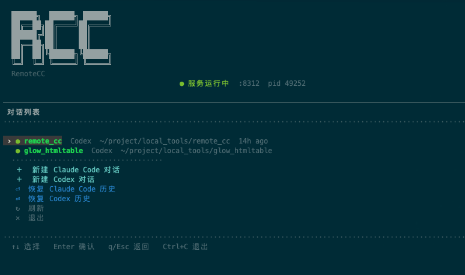

# RemoteCC — Use Claude Code / Codex from Anywhere

[中文](README.md) | English

```
  ██████╗  ██████╗ ██████╗
  ██╔══██╗██╔════╝██╔════╝
  ██████╔╝██║     ██║
  ██╔══██╗██║     ██║
  ██║  ██║╚██████╗╚██████╗
  ╚═╝  ╚═╝ ╚═════╝ ╚═════╝
  RemoteCC
```

> **This tool was built with the help of Claude Code, and is still actively being improved. Bug reports and suggestions are very welcome — please open an [Issue](https://github.com/changdazhou/remote-cc/issues).**

---

## What is this?

**Access Claude Code and Codex from your phone, tablet, or any browser — all in real time.**

Claude Code and Codex are powerful AI coding assistants that run in your terminal — but only locally. RemoteCC breaks that limitation. Your agent session can be accessed simultaneously from a phone browser, a tablet, and a local terminal, with **all clients sharing the same PTY process in real time**.

This is not screenshots or log forwarding. It is **true bidirectional real-time sync** — type on your phone and the desktop sees it instantly; run something in the terminal and your phone shows the output right away. Disconnect any client at any time, and the agent keeps working in the background. Reconnect whenever you want, seamlessly.

---

## Key Features

- **Real terminal** — full color, interactive, and mouse support, just like using it locally
- **Real-time multi-client sync** — phone, tablet, and desktop all share the same agent session
- **Persistent sessions** — close the browser or drop SSH, the agent keeps running; reconnect anytime
- **History resume** — reads Claude Code / Codex history and resumes conversations in the right working directory
- **Directory-based task creation** — choose the working directory from the server directory tree
- **File browser** — browse server files in the web UI, preview code/images, copy paths
- **Session manager** — run `remotecc` on the server to get a visual menu for managing sessions
- **Detach shortcut** — `Ctrl+]` goes back to the menu without killing the agent
- **Mobile-optimized** — responsive UI, comfortable to use on a phone
- **Customizable appearance** — 9 UI styles, dark/light color themes, and multiple icon styles; defaults to Studio + Aurora + Material

---

## Upload Files / Images to Agent

The web terminal supports three ways to pass files to Claude Code or Codex:

| Method | How |
|--------|-----|
| Click to select | On mobile, tap the upload button in the terminal shortcut bar and choose any file or image |
| Drag & drop | Drag files directly onto the terminal area |
| Paste image | Screenshot then Ctrl+V (auto-uploads) |

Files are stored to `~/.rcc/uploads/` on the server, and the path is automatically typed at the terminal cursor — just press Enter or continue your agent command.

---

## File Browser

Click the folder icon in the top bar to open the file browser. It opens at the server root directory `/` by default.

| Action | Description |
|--------|-------------|
| Single-click a file | Preview on the right (code with line numbers, images inline) |
| Double-click a file | Full-screen view — easier to read on mobile |
| Double-click a folder | Navigate into it |
| New folder button | Create a subdirectory in the current directory |
| Copy path button | Copy the absolute path of the file or folder |
| Upload / download buttons | Upload into the current directory / download files |
| Drag files | Drop files onto the file browser to upload them into the current directory |
| Path input box | Type a path directly and press Enter to jump there |

The settings page can configure the file browser default path, temporary shell cwd, new-session default directory, and Web login password.

Supported preview types: `.md` `.txt` `.py` `.js` `.ts` `.json` `.sh` `.yaml` and other code/text files, plus common image formats (`png` `jpg` `gif` `webp`).

---

## Temporary Shell

Click the terminal icon in the top bar to open a temporary shell terminal. It is a normal shell PTY and does not enter the RemoteCC session list; closing the browser or page ends the process. It prefers `zsh`, then `fish`, `bash`, and `sh`; set `RCC_SHELL` or `REMOTECC_SHELL` to override it. For persistence, run `tmux` inside it.

---

## How Real-Time Sync Works

```
               You have three windows open
                          │
       ┌──────────────────┼──────────────────┐
       ▼                  ▼                  ▼
  Phone browser     Desktop browser    Local terminal
  (WebSocket)        (WebSocket)      (Unix Socket)
       │                  │                  │
       └───────┬──────────┘                  │
               ▼                             │
         PTY Manager  ◀───────────────────────┘
               │
               ▼
        agent process (always running)
```

**Any client input → PTY stdin → all clients see the output**

This is not mirroring or proxying — multiple subscribers share the same PTY master fd. Even if you disconnect all clients, the agent keeps executing in the background.

---

## Quick Start

```bash
git clone https://github.com/changdazhou/remote-cc.git
cd remote-cc
bash install.sh
```

The install script is fully interactive and auto-detects your environment.

RemoteCC auto-detects Claude Code and Codex; at least one of them must be installed. New sessions can choose the agent, and history resume supports Claude Code's `~/.claude/projects/` plus Codex session records from `~/.codex/sessions/`.

If Codex or Claude Code needs a proxy, configure `CODEX_PROXY` / `CLAUDE_PROXY` in the installer. The proxy is injected only into the selected agent CLI, not into RemoteCC globally. The prompt uses `http://127.0.0.1:7890` as a generic example.

After installation:

```bash
remotecc start     # Start the service
remotecc           # Open the visual session manager
```

Or open `http://<server-ip>:8310` in a browser.

---

## Commands

```bash
# Service management
remotecc start          # Start service (daemon, auto-restart on crash)
remotecc stop           # Stop service
remotecc restart        # Full restart (use after server-side updates)
remotecc reload         # Hot reload (no session interruption)
remotecc update         # Pull latest version and auto-restart/reload
remotecc status         # Show whether the service is running

# Daily use (run on the server)
remotecc                # Open visual session manager
remotecc attach <name>  # Jump directly into a named session
```

Inside any session: **`Ctrl+]`** goes back to the menu without killing the agent.

---

## Changelog

### 2026-06-03

- **Web console enhancements**: directory picker for new sessions, plus a file browser with `/` root access, folder creation, upload/download, and path copy
- **Temporary shell**: adds a non-persistent shell terminal in the Web top bar, preferring `zsh` by default
- **Mobile terminal**: shortcut bars are mobile-only; Shell mode uses dedicated shell shortcuts
- **Appearance and language**: defaults to Studio + Aurora + Material, with 9 UI styles, dark/light color themes, 6 icon styles, and complete zh/en switching
- **Settings persistence**: Web settings are saved to `~/.rcc/web-settings.json`, including default paths, themes, terminal preferences, and language
- **TUI detach fix**: fixes first `Ctrl+]` detach after creating a session from `rcc-tui`

### 2026-05-21

- **Codex history resume**: reads real session metadata from `~/.codex/sessions/`, groups sessions by working directory, and resumes with the correct cwd
- **Resume UI**: Web/TUI Codex history is grouped by working directory without the extra `~/.codex/history.jsonl` layer
- **Mobile terminal**: improves xterm bottom-locking after async writes to reduce blank space under Codex output

### 2026-05-19

- **Codex support**: new sessions can choose Claude Code or Codex, and active sessions show the agent type
- **History resume**: supports restoring conversations from Claude Code / Codex history
- **Agent proxy**: installer and updater support `CODEX_PROXY` / `CLAUDE_PROXY`, scoped only to the selected agent CLI
- **Service management**: fixes `rcc-tui` service-state detection and shows the owning process when a port is occupied

### 2026-05-12

- **File browser**: browse server files, preview code/images, double-click for fullscreen, copy path
- **Hot reload**: `remotecc reload` restarts only the API layer, active agent sessions are not interrupted
- **remotecc update**: detects what changed and automatically restarts or hot-reloads as needed
- **remotecc attach**: opens the session manager and goes directly into the named session; detaching returns to the menu instead of exiting
- **Login redirect**: when the service restarts and the token expires, the browser automatically shows the login page instead of a blank screen

---

## Screenshots

| Web sessions | Web terminal |
|---|---|
|  |  |

| Mobile sessions | TUI session manager |
|---|---|
|  |  |

---

## Documentation

- [Installation Guide](docs/installation.md)
- [Usage Manual](docs/usage.md)
- [API Reference](docs/api.md)
- [Architecture](docs/architecture.md)
- [Development Guide](docs/development.md)

---

## Contributing

This tool is young and actively evolving. Contributions welcome:

- 🐛 [Report a bug](https://github.com/changdazhou/remote-cc/issues/new?labels=bug)
- 💡 [Request a feature](https://github.com/changdazhou/remote-cc/issues/new?labels=enhancement)
- 🔧 Submit a PR

---

## License

[Apache 2.0](LICENSE) © 2026 changdazhou
